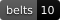

<h1 align="center">Math Dojo 🥋</h1>
<p align="center"><strong>Earn your belt, one small step at a time.</strong></p>

<p align="center">
  <a href="https://playmathdojo.com"></a>
</p>

<p align="center">
  <a href="LICENSE"></a>
  <a href="CONTENT-LICENSE.md"></a>
  
  
  
  
  
  <a href="https://ko-fi.com/D0J123HIA2"></a>
</p>

A free, belt-ranked math practice game inspired by the Kumon method's small-step worksheets — rebuilt as a martial-arts progression that takes you from `3 + 4` all the way to limits, derivatives and integrals. No account, no payment, no install: it runs in the browser at **[playmathdojo.com](https://playmathdojo.com)**.

## Two journeys

### 🥋 Normal mode — build the reflex

Ten belts, 243 stripes, every problem generated on the fly so the well never runs dry:

| Belt | Content |
|------|---------|
| White · Blue · Purple · Brown | Addition, subtraction, multiplication (complete times tables, 2–10), division |
| Green | Number mastery: powers, roots, primes, GCD/LCM, percentages, rule of three, scientific notation |
| Black (7 degrees) | Fractions, decimals (through hundredths), algebra, equations, functions, pre-calculus |
| Red (4 degrees) | Plane geometry, solid geometry, trigonometry |
| Gold (8 degrees) | Entrance-exam math: logs & exponentials, sequences, counting & probability, matrices & systems, polynomials & complex numbers, analytic geometry, inequalities & absolute value |
| Digital | Programmer math: binary/hex, modulo, bitwise logic, sets, recursion, graphs, step counting |
| Coral | Calculus I — limits, derivatives, integrals. The rarest rank. |

Every belt ends with a **graduation exam** — one question from each skill, single page, in learning order. Passing it is what earns the belt.

### 🥷 Ninja mode — prove you can read the problem

Completing a normal belt unlocks its **ninja twin**: the same math, hidden inside hand-written word problems (480 stories in three languages, served shuffled). The whole app flips to a dark dojo theme. Story sophistication grows with the belt — sticker trades on White Ninja, drug half-lives, circuit impedances and cache hit rates by the end. Finish **both** journeys and you become a **Ninja Master**: the dojo keeps its night colors forever and your title becomes shareable.

## How mastery works

- **Small-step lessons**: every stripe opens with a worked example — self-taught, no lecture — often with a purpose-built diagram (number lines, balance scales, function machines, right triangles, Riemann bars…).
- **Page-based drills with checkpoints**: pages of a dozen problems; each page that meets the bar (80 % accuracy, plus average speed when timed mode is on) is saved instantly. Leave mid-stripe and you resume on the page you reached — on any device, once logged in.
- **Learn from mistakes**: a wrong answer pauses with the correct one on screen until you tap *OK, got it* — and the reading time never counts against your clock. The problem returns later in the page for you to beat.
- **Timed mode is optional**: a preference toggle makes passing about accuracy alone, while the clock keeps running only for the cosmetic S/A speed ranks.
- **Anti-repetition engine**: generated drills never show the same problem or the same answer back-to-back, and spread repeats across the session.

## The extras

- 🖍️ **Infinite whiteboard** — a floating scratchboard (pan, pinch-zoom, dot grid) available everywhere; every exercise has a button that drops its statement onto the board as a draggable card. Scribbles survive reloads.
- 🏅 **Shareable belt medals** — earned on the results screen, revisitable in the Hall of Fame, shareable via the native share sheet.
- 📜 **Certificate of Mastery** — completing every stripe unlocks a personalized certificate (your name, the ten belt colors, the date) rendered to PNG: download it, print it, share it. Ninja Masters get an extra line.
- 🌎 **Three languages** — English, Portuguese and Spanish, all the way down to the word problems (with R$ / $ / € matched to each language).
- ☁️ **Optional account** — progress lives in `localStorage` and syncs through Supabase when you log in. No account required to play.

Add `?unlock=all` to the URL to browse every lesson without playing through the progression — for content review, not part of the real experience.

## Stack

React 19 + TypeScript + Vite. Plain CSS (custom properties + CSS Modules). Supabase for auth and progress sync. Deployed to Cloudflare Pages on every push to `main`.

## Development

```bash
npm install
npm run dev      # local dev server
npm run build    # typecheck + production build
npm run lint     # oxlint
```

## Support

Math Dojo is free and open source — the goal is that anyone can practice, no account or payment required. If it helps you, consider fueling the dojo:

[](https://ko-fi.com/D0J123HIA2)

## Licence, in one line

**The code is a gift. The content is not.** Math Dojo is free for everyone to play, and it stays
that way.

### Code — [GNU AGPL-3.0](LICENSE)

Read it, learn from it, fork it, self-host it. If you run a modified version as a public service,
the AGPL asks you to publish your changes too.

### Content — © 2026 Lucas Morosov, all rights reserved

The 480 word problems, the lessons, the belt curriculum, the name and the artwork are **not**
covered by the code licence and are not licensed for reuse. See **[CONTENT-LICENSE.md](CONTENT-LICENSE.md)**.

That reservation is deliberate, and it is what keeps this free: it means nobody can put a paywall
in front of work that was given away. Fork the code and write your own problems and the result is
yours, with my blessing — the app took weeks, the content took months.

Building on it? A credit is appreciated. Not required — it's just good to know where a thing ended
up. Want to use the content for a school, a nonprofit, a language I don't cover? Just ask; the
answer to a genuine use is very likely yes.
